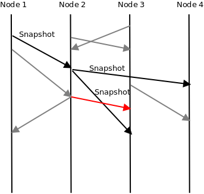
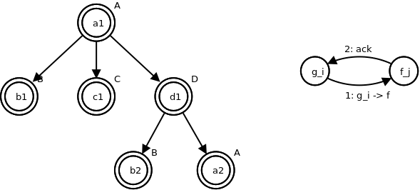
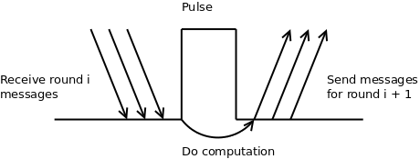
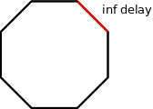
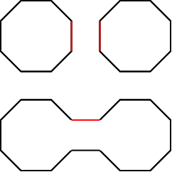

Distributed Algorithms
======================

:Author: Dima Kuznetsov

Lecture 1
~~~~~~~~~

Intro
-----

Key differences between centralized and distributed computation:

* Asynchronicity of the network.
* Fault / unavailability of nodes.

This adds uncertainty to distributed algorithms.

Models of distributed computation
---------------------------------

We can come up with many different models to describe a distributed computation
and its environment, e.g.

How nodes share information:

* **Message passing** - each node is connected to a group of other nodes, each
  via a different port, and can send/receive messages from those ports.
* **Shared memory** - all nodes have access to a piece of shared memory, and
  can exchange information by writing and reading from the memory.

What knowledge the nodes have:

* Does each one have a unique ID?
* Do they know the identity of other computers?
* Do they know the network topology?
* Do they know the total number of nodes?

Do nodes suffer faults:

* **No faults** - all nodes are always operational and run their computation
  as programmed.
* **Fail/Stop** - a node can occaionally fail. The failure is complete, i.e. a
  failed node goes off-line.
* **Byzantine** - nodes can fail but remain on-line, yielding malicious or
  invalid results.
* **Rational agents** - nodes can "cheat" in order to affect the result of an
  algorithm, e.g. a node affects leader election to minimize the chance of
  being chosen leader to do less computation, or vice versa, maximizing the
  change to be in control of task distribution.

We can also talk about complexity of distributed algorithms:

* *Time complexity* - How long does it take the algorithm to finish?
* *Message complexity* - How many messages are sent in the running time of the
  algorithm.


Message passing
---------------

In the first part of this course we'll focus on problems modeled with message
passing, those include:

* Graph coloring
* DNS
* Shortest path

Each node is modeled as a graph vertex and each port between 2 nodes as graph
edge:

::

 +------+
 |Node 1|
 |      +--------+
 +--+---+        |          +---------+
    |            +----------+ Node 2  |
    |                       |         |
    |                       +----+----+
    |                            |
    |                            |
    |            +---------------+
    |            |
    |            |
    |       +----+--+
    +-------+ Node 3|
            |       +-----------+          +--------+
            +-------+           |          | Node 4 |
                                +----------+        |
                                           +--------+

Each node is composed of the following:

* A *computation unit*, i.e. a CPU / something that runs our program.
* An *incoming message queue* where all incoming messages arrive, it also
  saves where each message came from.
* Bidirectional *ports* that connect the node to its neighbors.

::

 +---------------------------------+
 | Node 1                          | Port 1
 |                                 +---------------->
 |        +------------+           <----------------+
 |        |            |           |
 |        |    CPU     |           |
 |        |            |           | Port 2
 |        |            |           +---------------->
 |        +------------+           <----------------+
 |                                 |
 |                                 |
 |   FIFO                          | Port 3
 |  +---+---+---+---+---+-------+  +---------------->
 |  |   |   |   |   |   |          <----------------+
 |  |   |   |   |   |   |          |
 |  +---------------------------+  |
 +---------------------------------+


The model itself is event driven, a node handles all incoming messages in the
order they arrive. Each message is handled by a piece of code / program:

::

  upon receiving message M on port P:
      do something

The program can alter node's state (variables), do computations, and send
messages to adjacent nodes.

Some of the nodes are designated as *initiators* - nodes that start the
computation by sending the initail messages.

We'll assume that all events in the network are ordered, and nothing is really
simultaneous.

Broadcast and spanning tree example
-----------------------------------

We'll describe an aglorimth that performs a broadcast, that is sending a\
message to all of the nodes in the network.

Initiator node code:

::

    initailization(M):
        ackCounter = 0
        send M to all neighbors

    upon receiving Ack on port j:
        ackCounter++
        if ackCounter == | neigh |:
            Terminate()

On other nodes:

::

    initializtion():
        ackCounter = 0
        parent = nil

    upon receiving M != Ack on port j:
        if parent is nil:
            parent = j
            if | neighs | == 1:
                send Ack to j
            else:
                send M to all neighbors except j
        else:
            send Ack to j

    upon receiving Ack on port j:
        ackCounter++
        if ackCounter == | neigh | - 1:
            send Ack to parent


By using parent on each of the nodes we get a spanning tree (all nodes except
root have a single parent, exactly N - 1 edges).

Message M traverses twice on all edges except for the tree edges, where it
traverses once.

Total message complexity is :math:`2|E| - (|V| - 1)`

Snapshots
---------

A snapshot for a given node is its state at a given point in time, such that
given the snapshot, the node can be reverted to that point, and its computation
will continue.

For a network with multiple nodes, a snapshot is the collection of all
snapshots of all individual nodes. As we mentioned earlier, we don't have
simultaneous events in our model, thus no node snapshots are taken at the exact
same time.

To create a snapshot, we can use the Broadcast model above. An
arbitrary initiator node floods a custom message, and each node saves its state
once it handles the snapshot message.

We can also represent a snapshot as vector of times where each element is the
time a specific node took a snapshot (e.g. :math:`<t_1,t_2,\dots,t_N>`)

How do we make sure our snapshot is valid (i.e. the the distributed
computation will continue correctly?

Snapshot line:



   Black are snapshot messages, gray are valid messages, red is a violation.

Lecture 2
~~~~~~~~~
Termination Detection
---------------------

* `Static termination detection` - when a computation does not depend on other
  nodes, a node can perform its computation and terminate.
* `Hierachal model of Broadcast and Echo` - each node starts a computation once
  it receives a prompt from one of the neighbors. The node notifies its parent
  node once it finished its computation and all non parent nodes finished as
  well.

Diffusing computation
---------------------
* Only one node starts spontaneously
* All computations happen as a result of receiving a message.
* If no message is received a node performs arbitrary compuration.

This model is event driven and reactive.

Visual model for termination detection
``````````````````````````````````````
We can split each node into several `virtual` nodes.



In this model, for i < j, :math:`a_i` is created before :math:`a_j`. Naively
if `a_j` sends k messages, it will expect k acks then "return" (i.e. send ack
to its parent).


Event driven model
------------------

A distributed computation can be modeled as series of events
:math:`<e_1,e_2,\dots,e_k>` such than

1. :math:`e_i \Rightarrow e_j` if :math:`e_i` happened before :math:`e_j` at
   the same node.
2. :math:`e_i \Rightarrow e_j` if is :math:`e_i` is `send message M` command
   and :math:`e_j` is the event of receiving the same message `M`
3. :math:`e_i \Rightarrow e_j` if exists :math:`e_k` such that
   :math:`e_i \Rightarrow e_k \wedge e_k \Rightarrow e_j`

We can use this model to verify the validity of the snapshot. Given snapshot
:math:`S = <t_1,t_2,\dots,t_n>` of times each node took the snapshow, we can
run through the series of the events and check if any of the sent messages
violates the snapshot.

Syncronous model
----------------

In sychronous model we have a global clock. All nodes receive a pulse
simultaneously and run their tasks on the rising edge. The tasks can include
arbitrary computation or sending messages.

Our assumptions are:

* Pulse interval is constant
* All nodes receive pulses at the same moment
* Time between pulses is infinitely larger than the time it takes to send and
  receive a single message across a link.

We can then split the computation to rounds, where round i takes place on the
i-th pulse.

In this model all messages are received prior to the pulse, and put in the
queue. Then handled only once pulse occurs.



The node can be seen as a state machine where the state changes each pulse
and the next state is the result of current state and the sum of received
messages during last round:

.. math::

  q^{i+1}_v = f(q^{i}_{v},\mbox{messages received during round i})

Syncronizer
-----------

If we can find a way to provide all nodes with a pulse, we can model a
distributed on asyncronous network as if it was on the syncronous network.

:math:`\alpha` model
````````````````````

This model assumes that it receives a single message from each of the neighbors
each round. Once all neighbors sent a message to the node, it simulates the
pulse and advances to the next round.

* Each message carries its round number.
* If no message is required between a pair of adjacent nodes, we have to send
  a no-op message.
* Each incoming message is acked
* When a node receives acks for all its messages of round(i) it is considered
  `safe(i)` and can advance to the next round.

:math:`\beta` model
```````````````````

Given a leader L and a spanning tree:

* The leader sends the initial pulse message.
* Each node receiving the pulse sends it to its descendants in the spanning
  tree.
* A node is considered `safe` once all its descendants have acked.
* A leaf sends its ack right away.
* A non-leaf node sends its ack to the parent once its `safe`

Once the leader is `safe(i)`, i+1 th pulse is sent.

Complexity analysis
```````````````````
+----------------+----------+------+
| Model          | Messages | Time |
+================+==========+======+
| :math:`\alpha` | 2|E|     | O(1) |
+----------------+----------+------+
| :math:`\beta`  | 2 n      | H    |
+----------------+----------+------+

Where H is the depth of the spanning tree

Hybrid approach - :math:`\gamma` model
``````````````````````````````````````

* Split the spaning tree into smaller spanning trees.
* Run :math:`\beta` inside the subtrees
* Run :math:`\alpha` between the subtrees

We have to introduce new messages but the algorithms stay relatively the same,
we can use `Safe+EchoSafe` inside subtrees and `TreeSafe+EchoTreeSafe` between
the subtrees.

Given:

* `h` - the hight of the tree after we compresses nodes into subtrees
* `D` - number of edges connecting different subtrees

The complexity is

+----------------+----------+------+
| Model          | Messages | Time |
+================+==========+======+
| :math:`\gamma` | 2|D|+2n  | h    |
+----------------+----------+------+

We can optimize the edge/subtree selection s.t. each subtree is shallow and
the number of inter subtree edges is low.


Lecture 3
~~~~~~~~~
Leader election on a ring
-------------------------

Requirement: each CPU has a unique name.

Without the above requirement we cannot guarantee leader election. Consider a
syncronous network of 2 indentical anonymous nodes. If a deterministing leader
election algorithm exists, it consists of a finite series of messages each node
sends. For each of the nodes this series is identical to the other because the
nodes are identical. So at each round the state of both nodes is identical.
Once our algorithm is done (it is finite), both nodes are wither leaders or not
leaders. A more detailed proof can be found here_

.. _here: https://en.wikipedia.org/wiki/Leader_election#Anonymous_rings

Now lets consider a ring where each node has a unique name (nodes still don't
necesarrily know n).

We will come up with an algorithm for an asyncronous network. Our leader will
be the node with the maximum name.

A naive algorithm
`````````````````

The initial action each node will do is sending its own name on clockwise edge.
Then upon each message received on a counter-clockwise edge, send on the
clockwise edge max(node's name, received name), set this value as leader.
Continue doing so until the last saved leader name is received again on the
counter-clockwise edge.

The time complexity here is :math:`O(n)` because leader's message has to
traverse the whole ring.

For the message complexity we'll have :math:`O(n^2)`. Consider a scenario where
2nd largest node is on one node clockwise from the largest node, and 3rd is 2
nodes clockwise, and so on. Second largest name will travel n - 1 node, 3rd
largest will traverse n - 2 and so on, yielding the second order polynomial.

A more efficient algorithm
``````````````````````````
In this algorithm, as the one above, all nodes start as candidates.

If a node receives a name greater than its own, it resigns and becomes a relay.
A relay node passes a message received from left node to the right node and
vice-versa.

Initially, each node sends its name both ways and waits for the names of the
neighbors. A node will remain a candidate if its greater from boths its
neighbors. After the first round we'll have at most :math:`n / 2` candidate
nodes. Once a node completes a round (and remains candidate) it initiates
another round by sending its name both ways, at this moment its neighbors are
relays and the messages will reach other candidates.

The leader is elected once only one candidate remains. This happens when node
receives its name from both neighbors (both messages did a round-trip, all
other nodes are relays).

Each round we halve the number of candidates thus it takes total of
:math:`O(\log n)` rounds to finish, so total time is :math:`O(n \cdot \log n)`.

Each round a candidate sends 2 messages, so message complexity is
:math:`O(2n \cdot \log n)`

Better lower bound
``````````````````

Can we achieve a better bound for leader election with the given assumptions?

We'll first define `open schedule`

::

  The schedule of network is said to be open if the network contains an open
  edge. An edge is said to be open of no message traversing the edge was
  received so far.

We'll assume we have a :math:`\Omega(n \cdot \log n)` algorithm, we'll run it
on a ring with open schedule. WLOG we can assume that at least one message must
traverse the open edge (otherwise a whole ring can be hidden behind it).



Let `M(n)` be the number of messages an algorithm takes on n sized ring.

We'll now take our ring from above and add another ring with open schedule.
We'll connect the rings once the algorithm finished exchanging messages (and
waits to pass a message on the open edge).



Once the rings are connected each of the rings will notify the other ring of
its leader.

At worst case a message will traverse `n/2-1` nodes, meaning that our algorithm
is:

.. math::

  M(n) = 2 \cdot M(n / 2) + (n / 2 - 1) > \Omega(n \cdot \log n)

We've forced the algorithm to send :math:`\Omega(n \cdot \log n)` messages,
showing that a better bound than :math:`O(n \cdot \log n)` is not possible
under our assumptions.
